## About Me  

Since mid-2024, I have been with the [Swiss Federal Audit Office (SFAO)](https://www.efk.admin.ch/), where I contribute on the intersection of agentic artificial intelligence and financial auditing. My work aims to develop novel approaches leveraging deep learning techniques to make our audits more effective.  

Previously, I was a [DAAD IFI](https://www.daad.de/en/) Postdoc at the [International Computer Science Institute (ICSI)](https://www.icsi.berkeley.edu/icsi/), affiliated with [UC Berkeley](https://www.berkeley.edu/). Before, I completed a Ph.D. at the [University of St.Gallen (HSG)](https://www.unisg.ch) within the [AI:ML research group](https://ics.unisg.ch/chair-aiml-borth/), under the supervision of [Damian Borth](https://scholar.google.com/citations?user=J-8Z038AAAAJ&hl=en) and [Miklos A. Vasarhelyi](https://scholar.google.com/citations?hl=en&user=MBJ_kK4AAAAJ). During my Ph.D., I was a visiting [Swiss Mobi.Doc](http://funding.unisg.ch/en/programmes/1497) research fellow at the [Continuous Audit and Reporting Research Lab (CARLab)](https://raw.rutgers.edu/) at [Rutgers University](https://www.rutgers.edu) from 2022 to 2023.  

After graduating from the [University of Mannheim](https://www.uni-mannheim.de/en/), I spent nearly a decade working in the [Forensic Services](https://www.pwc.com/gx/en/services/forensics.html) practice at [PricewaterhouseCoopers (PwC)](https://www.pwc.com), specializing in advanced data analytics for forensic accounting and fraud investigations.  

  

    
    
    
  

  

    
    
    
    
    
  

## Recent News

  

    
10-2024

    
Our research at the <a href="https://www.icsi.berkeley.edu/icsi/" target="_blank">ICSI</a> in Berkeley, was featured in the <a href="https://www.daad.de/de/der-daad/daad-journal/themen/2024/nachwuchsprogramm-fuer-kuenstliche-intelligenz-und-informatik/" target="_blank">DAAD Journal</a>. Yay!

  

  

    
09-2024

    
Paper accepted for the <a href="https://ai-finance.org/" target="_blank">ACM ICAIF 2024 Conference</a> in Brooklyn, USA.

  

  

    
07-2024

    
Paper accepted for the <a href="https://www.sciencedirect.com/journal/international-journal-of-accounting-information-systems" target="_blank">International Journal of Accounting Information Systems</a>.

  

  

    
02-2024

    
Our <a href="https://arxiv.org/abs/2401.06263" target="_blank">FedTabDiff</a> paper won a AAAI 2024 workshop best paper award!

  

  

    
12-2023

    
Papers accepted for the <a href="https://sites.google.com/view/aifin-aaai2024/home" target="_blank">AAAI 2024 WS on AI in Finance</a> in Vancouver, Canada.

  

  

    
10-2023

    
I defended my <a href="https://slsp-hsg.primo.exlibrisgroup.com/discovery/delivery/41SLSP_HSG:HSGswisscovery/12107937600005506">dissertation</a> on Deep-Learning in Financial Auditing. :D

  

## Selected Publications

Please see my [Google Scholar](https://scholar.google.com/citations?user=O6V5YkEAAAAJ&hl=en) for a complete list.

### **Journal Publications**

  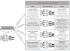
  

[**Deep Learning Meets Risk-Based Auditing: A Holistic Framework for Leveraging Foundation and Task-Specific Models in Audit Procedures**](https://www.sciencedirect.com/science/article/pii/S146708952500034X) 
T. Föhr, M. Schreyer, K. Moffitt, and K.-U. Marten 
International Journal of Accounting Information Systems (**IJAIS**) 57, 2026 
[[html](https://www.sciencedirect.com/science/article/pii/S146708952500034X)], [[pdf](https://www.sciencedirect.com/science/article/pii/S146708952500034X)]

  

  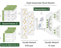
  

[**Connecting the Dots: Graph Neural Networks for Auditing 
Accounting Journal Entries**](https://publications.aaahq.org/ajpt/article-abstract/doi/10.2308/AJPT-2024-058/23197/Connecting-the-Dots-Graph-Neural-Networks-for?redirectedFrom=fulltext) 
Q. Huang, M. Schreyer, N. R. Michiles Jr., and Miklos A. Vasarhelyi 
AUDITING: A Journal of Practice & Theory (**AJPT**), 2026 
[[html](https://publications.aaahq.org/ajpt/article-abstract/doi/10.2308/AJPT-2024-058/23197/Connecting-the-Dots-Graph-Neural-Networks-for?redirectedFrom=fulltext)], [[pdf](https://publications.aaahq.org/ajpt/article-abstract/doi/10.2308/AJPT-2024-058/23197/Connecting-the-Dots-Graph-Neural-Networks-for?redirectedFrom=fulltext)]

  

  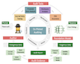
  

[**Artificial Intelligence Co-Piloted Auditing**](https://www.sciencedirect.com/science/article/abs/pii/S1467089524000319) 
H. Gu, M. Schreyer, K. Moffitt, and Miklos A. Vasarhelyi 
International Journal of Accounting Information Systems (**IJAIS**) 54, 2024 
[[html](https://www.sciencedirect.com/science/article/pii/S1467089524000319)], [[pdf](https://www.sciencedirect.com/science/article/abs/pii/S1467089524000319)]

  

### **Conference Publications**

  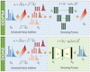
  

[**Diffusion-Scheduled Denoising Autoencoders for Anomaly Detection in Tabular Data**](https://dl.acm.org/doi/pdf/10.1145/3711896.3736910) 
T. Sattarov, M. Schreyer, and D. Borth 
ACM SIGKDD Conference on Knowledge Discovery and Data Mining (**KDD**), 2025 
[[html](https://dl.acm.org/doi/10.1145/3711896.3736910)], [[pdf](https://dl.acm.org/doi/pdf/10.1145/3711896.3736910)]

  

  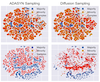
  

[**Imb-FinDiff: Conditional Diffusion Models for Class Imbalance Synthesis of Financial Tabular Data**](https://dl.acm.org/doi/pdf/10.1145/3677052.3698659) 
M. Schreyer, T. Sattarov, A. Sim, and K. Wu 
ACM International Conference on Artificial Intelligence in Finance (**ICAIF**), 2024 
[[html](https://dl.acm.org/doi/10.1145/3677052.3698659)], [[pdf](https://dl.acm.org/doi/pdf/10.1145/3677052.3698659)]

  

  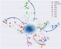
  

[**FinDiff: Diffusion Models for Financial Tabular Data Generation**](https://arxiv.org/pdf/2309.01472.pdf) 
T. Sattarov, M. Schreyer, and D. Borth 
ACM International Conference on Artificial Intelligence in Finance (**ICAIF**), 2023 
[[html](https://arxiv.org/abs/2309.01472)], [[pdf](https://arxiv.org/pdf/2309.01472.pdf)]

  

  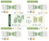
  

[**Federated and Privacy-Preserving Learning of Accounting Data in Financial Statement Audits**](https://arxiv.org/pdf/2208.12708.pdf) 
M. Schreyer, T. Sattarov, and D. Borth 
ACM International Conference on Artificial Intelligence in Finance (**ICAIF**), 2022 
[[html](https://arxiv.org/abs/2208.12708)], [[pdf](https://arxiv.org/pdf/2208.12708.pdf)]

  

  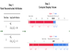
  

[**RESHAPE: Explaining Accounting Anomalies in Financial Statement Audits by enhancing SHapley Additive exPlanations**](https://arxiv.org/pdf/2209.09157.pdf) 
R. Mueller, M. Schreyer, T. Sattarov, and D. Borth 
ACM International Conference on Artificial Intelligence in Finance (**ICAIF**), 2022 
[[html](https://arxiv.org/abs/2209.09157)], [[pdf](https://arxiv.org/pdf/2209.09157.pdf)]

  

  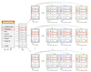
  

[**Multi-view Contrastive Self-Supervised Learning of Accounting Data Representations for Downstream Audit Tasks**](https://arxiv.org/pdf/2109.11201.pdf) 
M. Schreyer, T. Sattarov, and D. Borth 
ACM International Conference on Artificial Intelligence in Finance (**ICAIF**), 2021 
[[html](https://arxiv.org/abs/2109.11201)], [[pdf](https://arxiv.org/pdf/2109.11201.pdf)]

  

  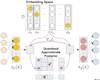
  

[**Learning Sampling in Financial Statement Audits using Vector Quantised Variational Autoencoder Neural Networks**](https://arxiv.org/pdf/2008.02528.pdf) 
M. Schreyer, T. Sattarov, A. Gierbl, B. Reimer, and D. Borth 
ACM International Conference on Artificial Intelligence in Finance (**ICAIF**), 2020 
[[html](https://arxiv.org/abs/2008.02528)], [[pdf](https://arxiv.org/pdf/2008.02528.pdf)]

  

  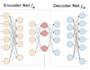
  

[**Detection of Anomalies in Large-Scale Accounting Data using Deep Autoencoder Networks**](https://arxiv.org/pdf/1709.05254.pdf) 
M. Schreyer, T. Sattarov, D. Borth, A. Dengel, and B. Reimer 
Nvidia's GPU Technology Conference (**GTC**), 2018 
[[html](https://arxiv.org/abs/1709.05254)], [[pdf](https://arxiv.org/pdf/1709.05254.pdf)]

  

### **Workshop Publications**

  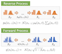
  

[**FedTabDiff: Federated Learning of Diffusion Probabilistic Models for Synthetic Mixed-Type Tabular Data Generation**](https://arxiv.org/pdf/2401.06263.pdf) 
T. Sattarov, M. Schreyer, and D. Borth 
AAAI Workshop on AI in Finance for Social Impact (**AIFinSi**), 2024 
[[html](https://arxiv.org/abs/2401.06263)], [[pdf](https://arxiv.org/pdf/2401.06263.pdf)], [[poster](https://drive.google.com/file/d/1KiXfMxygEfhClO7P17_rYT_oJT4VzBMM/view?usp=sharing)]

  

  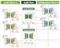
  

[**Federated Continual Learning to Detect Accounting Anomalies in Financial Auditing**](https://arxiv.org/pdf/2210.15051.pdf) 
M. Schreyer, H. Hemati, D. Borth, and Miklos A. Vasarhelyi 
NeurIPS Workshop on Federated Learning (**NeurIPS-FL**), 2022 
[[html](https://arxiv.org/abs/2210.15051)], [[pdf](https://arxiv.org/pdf/2210.15051.pdf)], [[poster](https://drive.google.com/file/d/1KhbVDWEsL6PdnvjZdt8QKHdme6YeKwtK/view?usp=sharing)]

  

  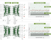
  

[**Continual Learning for Unsupervised Anomaly Detection in Continuous Auditing of Financial Accounting Data**](https://arxiv.org/pdf/2112.13215.pdf) 
H. Hemati, M. Schreyer, and D. Borth 
AAAI Workshop on AI in Financial Services (**AAAI-WFS**), 2022 
[[html](https://arxiv.org/abs/2112.13215)], [[pdf](https://arxiv.org/pdf/2112.13215.pdf)]

  

  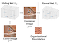
  

[**Leaking Sensitive Financial Accounting Data in Plain Sight using Deep Autoencoder Neural Networks**](https://arxiv.org/pdf/2012.07110.pdf) 
M. Schreyer, C. Schulze, and D. Borth 
AAAI Workshop on KD in Financial Services (**AAAI-KDF**), 2021 
[[html](https://arxiv.org/abs/2012.07110)], [[pdf](https://arxiv.org/pdf/2012.07110.pdf)]

  

  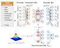
  

[**Adversarial Learning of Deepfakes in Accounting**](https://arxiv.org/pdf/1910.03810.pdf) 
M. Schreyer, T. Sattarov, B. Reimer, and D. Borth 
NeurIPS Workshop on Robust AI in Financial Services (**NeurIPS**), 2019 
[[html](https://arxiv.org/abs/1910.03810)], [[pdf](https://arxiv.org/pdf/1910.03810.pdf)]

  

  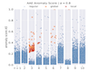
  

[**Detection of Accounting Anomalies in the Latent Space using Adversarial Autoencoder Neural Networks**](https://arxiv.org/pdf/1908.00734) 
M. Schreyer, T. Sattarov, C. Schulze, B. Reimer, and D. Borth 
KDD Workshop on Anomaly Detection in Finance (**KDD**), 2019 
[[html](https://arxiv.org/abs/1908.00734)], [[pdf](https://arxiv.org/pdf/1908.00734)]

  

### **ArXiv and SSRN Preprints**

  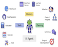
  

[**Artificial Intelligence Agentic Auditing**](https://papers.ssrn.com/sol3/Delivery.cfm/4909147.pdf) 
H. Gu, M. Schreyer, K. Moffitt, and Miklos A. Vasarhelyi 
Preprint available open-access (**SSRN**), 2024 
[[html](https://papers.ssrn.com/sol3/papers.cfm?abstract_id=4909147)], [[pdf](https://papers.ssrn.com/sol3/Delivery.cfm/4909147.pdf)]

  

  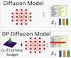
  

[**Differentially Private Federated Learning of Diffusion Models for Synthetic Tabular Data Generation**](https://arxiv.org/pdf/2412.16083) 
T. Sattarov, M. Schreyer, and D. Borth 
Preprint available open-access (**arXiv**), 2024 
[[html](https://arxiv.org/abs/2412.16083)], [[pdf](https://arxiv.org/pdf/2412.16083)]

  

### **Professional Journal Publications (in English)**

  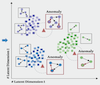
  

**A Graph Says More Than A Thousand Journal Entries - Harnessing Graph Autoencoder Networks in Auditing** 
Q. Huang, M. Schreyer, N.R. Michiles, and M.A. Vasarhelyi 
EXPERTsuisse, Expert Focus (12), 653-659 (**Expert Focus**), 2024 
[tba], [tba]

  

  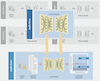
  

[**Collective Artificial Intelligence in Auditing - Advancing Audit Models through Federated Learning Without Sharing Proprietary Data**](https://drive.proton.me/urls/V4FZSAVVXW#pPFSLltzpXce) 
M. Schreyer, D. Borth, T.F. Ruud, and M.A. Vasarhelyi 
EXPERTsuisse, Expert Focus (04), 180-186 (**Expert Focus**), 2024 
[[html](https://drive.proton.me/urls/V4FZSAVVXW#pPFSLltzpXce)], [[pdf](https://drive.proton.me/urls/V4FZSAVVXW#pPFSLltzpXce)]

  

  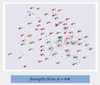
  

[**Artificial Intelligence Enabled Audit Sampling - Learning to Draw Representative Audit Samples from Large-Scale Journal Entry Data**](https://drive.proton.me/urls/SBEYX0S350#4qLWRnq1mWMR) 
M. Schreyer, A.S. Gierbl, T.F. Ruud, and D. Borth 
EXPERTsuisse, Expert Focus (04), 106-112 (**Expert Focus**), 2022 
[[html](https://drive.proton.me/urls/SBEYX0S350#4qLWRnq1mWMR)], [[pdf](https://drive.proton.me/urls/SBEYX0S350#4qLWRnq1mWMR)]

  

  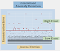
  

[**Artificial Intelligence in Internal Audit as a Contribution to Effective Governance - Deep-learning Enabled Detection of Anomalies**](https://drive.proton.me/urls/AK5FMJRYV8#v6WcQEZFnf2V) 
M. Schreyer, M. Baumgartner, T.F. Ruud, and D. Borth 
EXPERTsuisse, Expert Focus (01), 45-50 (**Expert Focus**), 2022 
[[html](https://drive.proton.me/urls/AK5FMJRYV8#v6WcQEZFnf2V)], [[pdf](https://drive.proton.me/urls/AK5FMJRYV8#v6WcQEZFnf2V)]

  

### **Professional Journal Publications (in German)**

  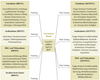
  

**Generative Künstliche Intelligenz und Risikoorientierter Prüfungsansatz** 
T. L. Föhr, K.-U. Marten, and M. Schreyer 
Der Betrieb, Nr. 30, 1681-1693, 2023  
[non open access]

  

  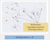
  

[**Stichprobenauswahl durch die Anwendung von Künstlicher Intelligenz - Lernen repräsentativer Stichproben aus Journalbuchungen**](https://www.alexandria.unisg.ch/server/api/core/bitstreams/22ca409e-6bbd-40ea-850e-954c184cd521/content) 
M. Schreyer, A.S. Gierbl, T.F. Ruud, and D. Borth 
EXPERTsuisse, Expert Focus (02), 10-18 (**Expert Focus**), 2022 
[[html](https://www.alexandria.unisg.ch/entities/publication/9635cd9a-009f-41b0-885c-27f55f4bf12c)], [[pdf](https://www.alexandria.unisg.ch/server/api/core/bitstreams/22ca409e-6bbd-40ea-850e-954c184cd521/content)]

  

  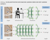
  

[**Künstliche Intelligenz im Internal Audit als Beitrag zur Effektiven Governance - Deep-Learning basierte Detektion von Buchungsanomalien**](https://www.alexandria.unisg.ch/server/api/core/bitstreams/bc37514d-5e2e-40a7-9498-54b55ebdc764/content) 
M. Schreyer, M. Baumgartner, T.F. Ruud, and D. Borth 
EXPERTsuisse, Expert Focus (01), 39-44 (**Expert Focus**), 2022 
[[html](https://www.alexandria.unisg.ch/entities/publication/ee751b6a-b5b0-4b8a-9a44-91468051e353)], [[pdf](https://www.alexandria.unisg.ch/server/api/core/bitstreams/bc37514d-5e2e-40a7-9498-54b55ebdc764/content)]

  

  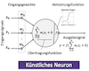
  

**Deep Learning für die Wirtschaftsprüfung - Eine Darstellung von Theorie, Funktionsweise und Anwendungsmöglichkeiten** 
A.S. Gierbl, M. Schreyer, P. Leibfried, and D. Borth 
Zeitschrift für Internationale Rechnungslegung (07/08), 349-355 (**IRZ**), 2021 
[non open access]

  

  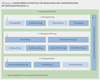
  

[**Künstliche Intelligenz in der Prüfungspraxis - Eine Bestandsaufnahme aktueller Einsatzmöglichkeiten und Herausforderungen**](https://www.alexandria.unisg.ch/server/api/core/bitstreams/89c29b85-7b6d-4812-8c06-295c8706bebc/content) 
A.S. Gierbl, M. Schreyer, P. Leibfried, and D. Borth 
EXPERTsuisse, Expert Focus (09), 612-617 (**Expert Focus**), 2020 
[[html](https://www.alexandria.unisg.ch/entities/publication/2db7c980-9613-4733-ba08-5c0963213311)], [[pdf](https://www.alexandria.unisg.ch/server/api/core/bitstreams/89c29b85-7b6d-4812-8c06-295c8706bebc/content)]

  

  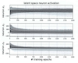
  

**Künstliche Intelligenz in der Wirtschaftsprüfung - Identifikation ungewöhnlicher Buchungen in der Finanzbuchhaltung** 
M. Schreyer, T. Sattarov, D. Borth, A. Dengel, and B. Reimer 
WPg - Die Wirtschaftsprüfung 72 (11), 674-681 (**WPg**), 2018 
[non open access]

  

## Invited Teaching & Guest Lectures

  

    
01/2023

    

**Audit Data Analytics**, Institute of Internal Auditors (IIA) Switzerland & University of St.Gallen (HSG), [Internal Auditing Programme](https://aca.unisg.ch/en/executive-education/internal-auditing-program/), view [[Notebooks](https://github.com/GitiHubi/courseACA)].

  

  

  

    
12/2022

    

**Artificial Intelligence in Auditing**, Frankfurt School of Finance and Management, [Certified Audit Data Scientist](https://www.fs.de/cads), view [[Notebooks](https://github.com/GitiHubi/CADS)].

  

  

<!--
  

    
11/2022

    

    **Federated Learning in Financial Auditing**, University of St.Gallen (HSG), [M.Sc. in Computer Science](https://www.unisg.ch/en/studium/programme/master/mcs/), view [[Notebooks](https://colab.research.google.com/github/HSG-AIML-Teaching/DL2022-Lab/blob/main/lab_4/colab_04.ipynb)].

    

    

-->
<!--

      

        
06/2022

        

    **Deep Learning and Applications**, University of St.Gallen (HSG), [Global School on Empirical Research Methods](https://gserm.org).
    
      

      

-->
<!--
      

        
04/2022

        

    
    **Applying Artificial Intelligence in Internal Audit Analytics**, [BI Norwegian Business School](https://www.bi.edu), Seminar GRC & Internal Audit in Switzerland, view [[Notebooks](https://github.com/GitiHubi/courseAAA)].
    
      

      

-->

## Conference Presentations & Invited Talks

  

    
11/2022

    

**Adversarial Learning of Deepfakes in Accounting**, The 53rd World Continuous Auditing & Reporting Symposium (WCARS), Rutgers University.

  

  

  

    
11/2022

    

**Federated and Privacy-Preserving Learning of Accounting Data in Financial Statement Audits**, 3rd ACM International Conference on AI in Finance (ICAIF).

  

  

  

    
08/2022

    

**Deep Learning in Financial Auditing**, Summer 2022 Weekly Technology Forum, Rutgers University, view [[Video 1](https://www.youtube.com/watch?v=HBEJ1up1P7I)], [[Video 2](https://www.youtube.com/watch?v=N2SR6OuoAgc)], [[Video 3](https://www.youtube.com/watch?v=xcJaczR2QWk)], [[Video 4](https://www.youtube.com/watch?v=g_ieTkE6u8A)], [[Video 5](https://www.youtube.com/watch?v=H3fLMhFD4a8)].

  

  

  

    
11/2021

    

**Multi-view Contrastive Self-Supervised Learning of Accounting Data Representations**, 2nd ACM International Conference on AI in Finance (ICAIF).

  

  

  

    
04/2021

    

<!-- **Learning Sampling in Financial Statement Audits using Vector Quantised Autoencoder Networks**, Nvidia's GPU Technology Conference (GTC), view [[Video](https://www.nvidia.com/en-us/on-demand/session/gtcspring21-e32377/)].

  

  

  

    
03/2021

    

-->

<!-- **Towards Financial Fraud Detection using Deep Learning**, Hong Kong Machine Learning Meetup (HKML), view [[Video](https://www.youtube.com/watch?v=DedO7ljw_9k)].

  

  

  

    
02/2021

    

-->

<!-- **Leaking Accounting Data in Plain Sight using Deep Autoencoder Networks**, AAAI Workshop on Knowledge Discovery from Unstructured Data in Finance.

  

  

  

    
10/2020

    

-->

<!-- **Learning Sampling in Financial Auditing using Vector Quantised Autoencoder Networks**, 1st ACM International Conference on AI in Finance (ICAIF).

  

  

  

    
08/2019

    

-->

<!-- **Detection of Accounting Anomalies using Adversarial Autoencoder Neural Networks**, 2nd KDD Workshop on Anomaly Detection in Finance.

  

  

  

    
04/2019

    

-->

**Creation of Adversarial Accounting Records to Attack Financial Statement Audits**, Nvidia's GPU Technology Conference (GTC), view [[Video](https://developer.nvidia.com/gtc/2019/video/s9361)].

  

  

-->

Last updated: July 21, 2026 (using [Anthropic's](https://www.anthropic.com) Claude Code)

---
